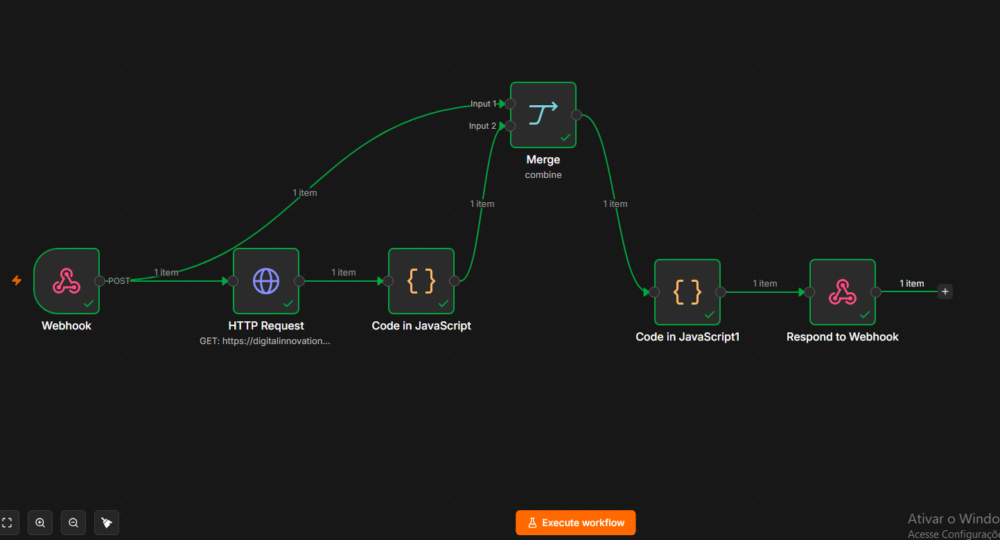

# 🚀 Assistente de Investimentos com RPA e N8N

Projeto desenvolvido como parte do **Formação N8N & IA Generativa**, promovido pela **DIO (Digital Innovation One)** em parceria com o **Santander**.

---

## 📌 Sobre o Projeto

Este projeto consiste em uma automação inteligente de ponta a ponta que realiza a coleta automatizada de dados de clientes em uma página web simulada e envia as informações para o **N8N** para cruzar os perfis de investidores (Conservador, Moderado e Arrojado) com opções de investimento recomendadas.

O objetivo é demonstrar como a combinação de técnicas de **RPA (Robotic Process Automation)** em Python com workflows de orquestração no N8N pode automatizar a comunicação do setor financeiro de forma simples e eficiente.

---

## 🛠️ Arquitetura e Tecnologias

A solução utiliza as seguintes tecnologias:

| Etapa | Tecnologia | Função |
| :--- | :--- | :--- |
| **Extração (RPA)** | Python + BeautifulSoup + Requests | Raspagem de dados (web scraping) e envio das requisições via HTTP POST. |
| **Orquestração** | N8N (Execução Local) | Recebimento do Webhook, leitura da base de investimentos e cruzamento de perfis. |
| **Interface & Editor** | Visual Studio Code (VS Code) | Ambiente de desenvolvimento integrado local para execução do Python e controle do versionamento. |
| **Bases de Dados** | HTML / CSV | Simulação de dados de clientes e opções de investimentos. |

---

## 💻 Ambiente de Desenvolvimento Local

Para este desafio, a execução foi realizada em um **ambiente local integrado via VS Code**:
- **Script Python:** Desenvolvido e executado no VS Code (`src/extrair_clientes.py`).
- **N8N Local:** Executado localmente em `http://localhost:5678`, permitindo comunicação direta com a URL do Webhook disparado pelo script em Python.

---

## 📸 Demonstração do Workflow

Abaixo está a demonstração do fluxo funcionando de ponta a ponta no N8N local após receber os dados enviados pelo robô em Python:

